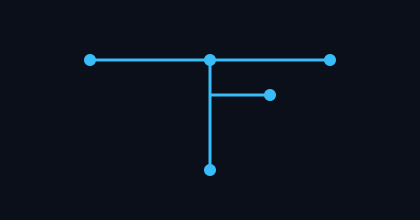

<p align="center">
  
</p>

# TradingFlow

A powerful, visual workflow orchestration platform for financial market analysis and automated trading.

## Features

- **Visual Workflow Builder**: Create complex trading and analysis pipelines using a node-based interface
- **Multi-Source Data Integration**: Fetch data from Yahoo Finance, Alpha Vantage, Binance, Bybit, MetaTrader 5
- **LLM Integration**: Support for OpenAI, Anthropic, OpenRouter, DeepSeek and more
- **Multi-Agent System**: Build collaborative AI agent teams for market analysis
- **RAG Support**: Vector database integration for knowledge management
- **Real-time Execution**: WebSocket-based progress tracking
- **Secure API Key Management**: Encrypted storage of all external service credentials
- **Extensible Architecture**: Easy to add custom nodes and integrations

## Architecture

```
TradingFlow/
├── backend/           # FastAPI backend
│   ├── app/
│   │   ├── core/      # Engine, security, config
│   │   ├── nodes/     # Node implementations
│   │   ├── agents/    # Multi-agent systems (LangGraph)
│   │   ├── services/  # External services (DB, Vector DB)
│   │   ├── models/    # Database models & Pydantic schemas
│   │   └── api/       # REST API endpoints
│   └── tests/
├── frontend/          # React + TypeScript (to be implemented)
├── docker-compose.yml # Infrastructure services
└── .env               # Environment configuration
```

## Quick Start

### Prerequisites

- Python 3.11+
- Docker & Docker Compose
- Node.js 18+ (for frontend development)

### 1. Clone and Setup

```bash
# Clone the repository
cd TradingFlow

# Create virtual environment
python -m venv venv
source venv/bin/activate  # On Windows: venv\Scripts\activate

# Install dependencies
cd backend
pip install -r requirements.txt
cd ..
```

### 2. Configure Environment

```bash
# Copy environment file
cp .env.example .env

# Edit .env and set your secret keys
# Important: Change SECRET_KEY and ENCRYPTION_KEY!
```

### 3. Start Infrastructure

```bash
# Start PostgreSQL, Redis, and Qdrant
docker-compose up -d

# Verify services are running
docker-compose ps
```

### 4. Run the Backend

```bash
cd backend
uvicorn app.main:app --reload --host 0.0.0.0 --port 8000
```

The API will be available at http://localhost:8000

### 5. API Documentation

- Swagger UI: http://localhost:8000/docs
- ReDoc: http://localhost:8000/redoc

## Core Concepts

### Nodes

Nodes are the building blocks of your workflows. Each node performs a specific operation:

- **LLM Node**: Call language models (OpenAI, Anthropic, OpenRouter, DeepSeek)
- **Data Fetcher**: Retrieve market data from various sources
- **Agent Node**: Run multi-agent analysis pipelines (coming soon)
- **Trading Node**: Execute trades on exchanges (coming soon)
- **RAG Node**: Query vector database for context (coming soon)

### Workflows

Workflows are directed graphs of nodes. Data flows from one node to another through connections. The visual editor (frontend) allows you to:

1. Drag and drop nodes onto a canvas
2. Configure node parameters
3. Connect nodes to define data flow
4. Execute workflows and monitor progress in real-time

### Execution Model

- **Asynchronous**: All node execution is async for maximum performance
- **Concurrent**: Independent nodes run in parallel (configurable concurrency limit)
- **Dependency-aware**: Nodes wait for their dependencies to complete
- **Fault-tolerant**: Configurable fail-fast or continue-on-error modes
- **Real-time updates**: WebSocket notifications for all execution events

## API Endpoints

### Authentication
- `POST /api/auth/register` - Register new user
- `POST /api/auth/login` - Login and get JWT token
- `GET /api/auth/me` - Get current user info

### Workflows
- `GET /api/workflows/` - List user's workflows
- `POST /api/workflows/` - Create new workflow
- `GET /api/workflows/{id}` - Get workflow details
- `PUT /api/workflows/{id}` - Update workflow
- `DELETE /api/workflows/{id}` - Delete workflow

### Execution
- `POST /api/execution/run` - Start workflow execution
- `GET /api/execution/executions` - List execution history
- `GET /api/execution/executions/{id}` - Get execution details

### WebSocket
- `WS /ws?client_id={id}` - Real-time execution updates

## Node Types

### LLM Node

Call various LLM providers with customizable prompts.

**Parameters:**
- Provider (OpenAI, Anthropic, OpenRouter, DeepSeek)
- Model selection
- Temperature, max tokens
- System prompt
- User prompt with `{{input.port_name}}` variable substitution

**Outputs:**
- `response`: Generated text
- `usage`: Token usage statistics

### Data Fetcher Node

Fetch financial data from multiple sources.

**Sources:**
- **Yahoo Finance** (Free): Stocks, crypto, forex, financial statements
- **Alpha Vantage** (API Key): Technical indicators, price data
- **Binance** (No key for public data): Crypto spot/futures
- **Bybit** (No key for public data): Crypto derivatives
- **MetaTrader 5** (Requires MT5 installed): Forex, stocks, futures

**Features:**
- Historical OHLCV data
- Technical indicators (Alpha Vantage)
- Financial statements (Yahoo Finance)
- Symbol information (MT5)
- Funding rates (Bybit futures)
- Built-in caching with configurable TTL

## Configuration

### Environment Variables

See `.env.example` for all available options.

Key settings:
- `DATABASE_URL`: PostgreSQL connection
- `REDIS_URL`: Redis connection
- `QDRANT_URL`: Vector database URL
- `SECRET_KEY`: JWT signing key (change this!)
- `ENCRYPTION_KEY`: Master key for API key encryption (change this!)
- `APP_URL`: Your application URL (for OpenRouter headers)

### Database Schema

The application uses SQLAlchemy ORM with the following main tables:
- `users`: User accounts
- `workflows`: Workflow definitions (JSON config)
- `workflow_executions`: Execution history
- `api_keys`: Encrypted API credentials

## Development

### Project Structure

```
backend/
├── app/
│   ├── main.py              # FastAPI application entry
│   ├── core/
│   │   ├── config.py        # Settings
│   │   ├── database.py      # DB connection
│   │   ├── engine.py        # Workflow executor
│   │   ├── security.py      # JWT & password utils
│   │   └── websocket.py     # WS connection manager
│   ├── models/              # SQLAlchemy & Pydantic models
│   ├── nodes/               # Node implementations
│   ├── agents/              # Multi-agent systems (coming soon)
│   ├── services/            # External services
│   └── api/                 # REST endpoints
└── tests/                   # Unit & integration tests
```

### Adding New Nodes

1. Create a new file in `backend/app/nodes/`
2. Inherit from `BaseNode`
3. Implement `execute()` and `get_ui_schema()`
4. Register in `backend/app/nodes/__init__.py`

Example:

```python
from .base import BaseNode

class MyCustomNode(BaseNode):
    display_name = "My Custom Node"
    description = "Does something useful"
    category = "custom"

    async def execute(self, inputs, context):
        # Your logic here
        return {"result": "success"}

    @classmethod
    def get_ui_schema(cls):
        return {
            "parameters": [
                {"name": "my_param", "type": "string", "title": "My Parameter"}
            ],
            "outputs": [
                {"name": "result", "type": "string"}
            ]
        }

# In __init__.py
from .my_custom_node import MyCustomNode
register_node("my_custom", MyCustomNode)
```

## Security Considerations

1. **Change default secrets**: Update `SECRET_KEY` and `ENCRYPTION_KEY` in production
2. **Use HTTPS**: Always use HTTPS in production
3. **API Key Storage**: All external API keys are encrypted at rest
4. **Authentication**: All endpoints require JWT authentication
5. **Rate Limiting**: Implement rate limiting in production (not included yet)
6. **Input Validation**: All inputs are validated using Pydantic models

## Production Deployment

### Using Docker

```bash
# Build and run with docker-compose
docker-compose -f docker-compose.prod.yml up -d
```

### Manual Deployment

1. Set up PostgreSQL, Redis, Qdrant
2. Configure environment variables
3. Run with Gunicorn:
```bash
gunicorn app.main:app -w 4 -k uvicorn.workers.UvicornWorker -b :8000
```

### Recommended Stack

- **Reverse Proxy**: Nginx or Traefik
- **Process Manager**: Gunicorn with Uvicorn workers
- **Monitoring**: Prometheus + Grafana (coming soon)
- **Logging**: ELK stack or Loki

## Roadmap

- [x] Phase 1: Core infrastructure & basic nodes (LLM, Data)
- [ ] Phase 2: Multi-agent system (LangGraph integration)
- [ ] Phase 3: RAG & vector database integration
- [ ] Phase 4: Trading execution (Binance, Bybit, MT5)
- [ ] Phase 5: Backtesting engine
- [ ] Phase 6: Frontend visual editor (React Flow)
- [ ] Phase 7: Advanced analytics & dashboards
- [ ] Phase 8: Plugin system for custom nodes

## Contributing

Contributions are welcome! Please:

1. Fork the repository
2. Create a feature branch
3. Make your changes
4. Add tests for new functionality
5. Submit a pull request

## License

GNU LGPLv3 License - see LICENSE file for details

## Disclaimer

This software is for educational and research purposes. Always do your own research before making financial decisions. The authors are not responsible for any financial losses incurred through the use of this software.

## Acknowledgments

Inspired by:
- [n8n](https://github.com/n8n-io/n8n) - Workflow automation
- [TradingAgents](https://github.com/TauricResearch/TradingAgents) - Multi-agent trading
- [ai-hedge-fund](https://github.com/virattt/ai-hedge-fund) - Agent-based investing
- [ContestTrade](https://github.com/FinStep-AI/ContestTrade) - Agent competition
- [TradingGoose](https://github.com/TradingGoose/TradingGoose.github.io) - Full-stack trading